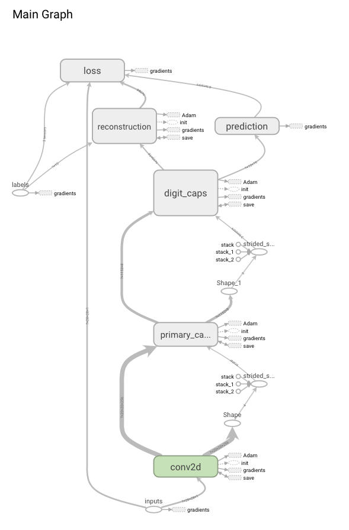
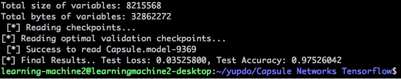
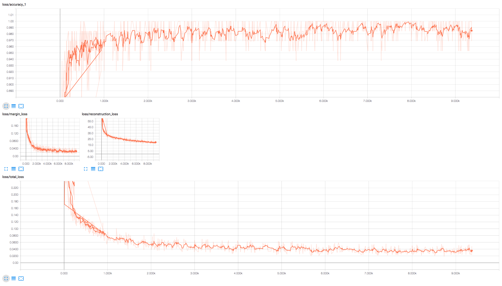

# Capsule Networks (CapsNet) in tensorflow

Tensorflow implementation of [Dynamic Routing Betwwen Capsules](https://arxiv.org/abs/1710.09829) (Capsule Networks, CapsNet).

Capsule is a vector that represents features with instantiation vector and its norm means the existence probability of the feature.

That is, features are not represented by single neurons, but capsule vectors.

It seems to overcome the limitations of max-pooing.

That is, capsules assure positional "equivalence", not "invariance", and considers spatial relationship between features.

Each capsule is learnt by "dynamic rounting", means "agreement" between low-level capsules.

## Model Description
In this implementation, CapsNet has 3 hidden layers: 1) original conv (256), 2) Primary Capsules, 3) Digit Capsules.

- 1) Original Conv: 256 filters (9x9), strides=1, Valid padding, ReLU
- 2) Primary Capsules: 32 number of 8D capsules, 9x9 and strides=2 conv filters 
- 3) Digit Capsules: 10 number of 16D capsules. *learnt by "Dynamic Routing"

## Implementation Graph (Tensorboard)

## Results

### MNIST classification (without augmentation)

- Accuracy

After 10 epochs with 64 batch_size, test accuracy was about 0.975 %.

- Losses

- Reconstruction

Test samples (original test images), Reconstruction by masking with y-label, and Reconstruction by masking without y-label.

## File Descriptions
- main.py : Main function of implementations, contained argument parsers, model construction, and test.
- model.py : CapsNet class
- download.py : Files for downloading MNIST. 
- ops.py : Some operation functions with tensorflow. *ConvCaps Layer implementation included*
- utils.py : Some functions dealing with image preprocessing.

## Prerequisites (my environments)
- Python 2.7
- Tensorflow > 0.14
If other libraries are needed, all libraries are available on pip install --upgrade "library_name"

## Usage

### Download dataset

First, you have to download MNIST dataset.

    $ python download.py mnist

If you want to uses other dataset, make image_load function and loaded them on self.x_data, self.y_data, self.x_test, self.y_test.

### Train CapsNet Model

To train a model with downloaded dataset:

    $ python main.py --epoch=10 --validation_check=False

If you (want to) have validation dataset and save models with lowest validation loss,

    $ python main.py --epoch=10 --validation_check=True

Also, you can adjust various hyper-parameters for learning. You can check FLAGS in "main.py"

### Test Trained Model

After training model, you can uses the model for test its performance.

    $ python main.py --train=False --validation_check=(True or False)

Then, 1) test performances printed, 2) reconstruction samples are saved in './samples', 3) tweak image results are save in './tweak'.

## For Understanding

- Many variables were tiled for parallel computing of tf.matmul by GPU.
- All representations of the tensor shape are parameterized for model generalization.

## To Do
- [ ] Tweak Instantiation vectors in digit caps
- [ ] Test with affMNIST dataset
- [ ] Test with Multi-MNIST test, overlapped characters.
